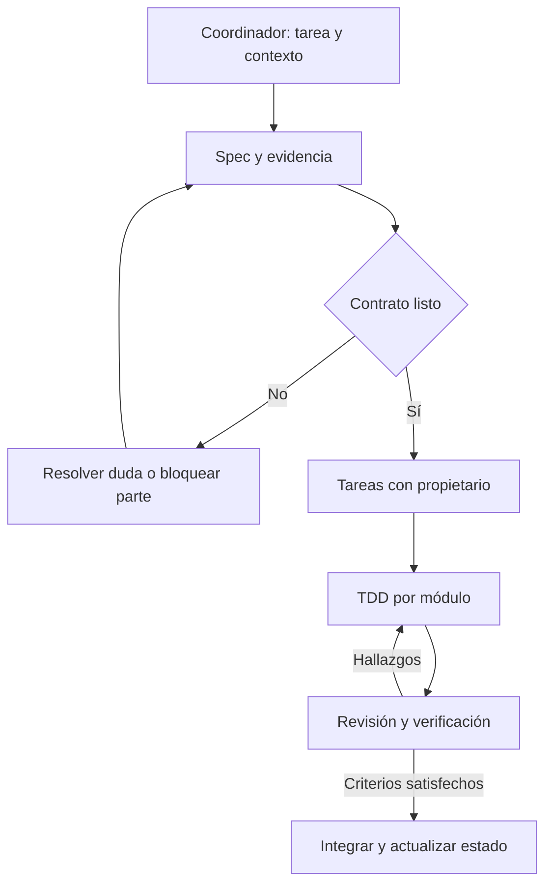

# Orquestación de subagentes

Este documento define un protocolo portable; no instala ni arranca agentes por sí solo. El coordinador lo ejecuta con la capacidad real de su runtime. Sin subagentes, usa los roles secuencialmente y registra que no hubo revisión independiente. Roles ≠ procesos siempre encendidos.

## Roles

| Rol | Skill principal | Entrega | Escritura habitual |
|---|---|---|---|
| Coordinator | copilot-orchestrate | Plan, asignación, integración, estado y cierre | state/memory, tareas, trazabilidad |
| Spec analyst | copilot-spec | Requisitos, aceptación, preguntas y propuesta | spec/proposal de la tarea |
| Rules researcher | champions-research | Fuentes/commits/licencias y matriz de soporte | docs/research y fixtures de referencia asignados |
| Architect | copilot-design | Contratos, modelo, ADR y fronteras | design y arquitectura asignada |
| Engine engineer | copilot-engine-tdd | Core/damage/speed/resolver/action tests y código | paquete/módulo asignado |
| Inference engineer | copilot-inference-search | Beliefs/meta/simulación/search y validación | paquete/módulo asignado |
| Integration engineer | copilot-integration | API/persistencia/LLM/UI según tarea concreta | apps o integración asignada |
| Reviewer | copilot-verify | Hallazgos reproducibles y aceptación | verificación asignada; no autoaprobar sin evidencia |

Los perfiles precisos de trabajo y restricciones están en [ROLES](ROLES.md); las skills en [SKILL_CATALOG](SKILL_CATALOG.md).

## Flujo por feature

La investigación de fuentes puede correr junto al diseño de tipos genéricos; una implementación mecánica espera la evidencia que necesita. Daño y speed pueden trabajarse en paralelo después de estabilizar contratos y datos. No anticipar fases enteras solo por ocupar agentes.

## Contrato de asignación

Usar [handoff template](../../templates/HANDOFF.md). Incluir objetivo, task/spec/REQ, archivos a leer, archivos que puede modificar, skill(s), dependencias, estado base, criterios y comandos existentes. Identificar archivos compartidos cuyo cambio exige volver al coordinador. Prohibir scope creep, mutaciones externas no autorizadas y cambios directos en state por múltiples workers.

## Concurrencia e integración

Un escritor por archivo; worktrees/ramas aisladas si se implementan tareas independientes. En workspace compartido asignar rutas disjuntas antes de arrancar. Ningún worker modifica lockfile/contratos compartidos a la vez que otro. El coordinador integra por dependencia, resuelve conflictos entendiendo el comportamiento y vuelve a probar lo afectado. No delegar una tarea bloqueada como si el bloqueo desapareciera.

## Revisión independiente

Entregar al reviewer spec, diff, fixtures y comandos; pedir comprobar comportamiento y contradicciones. No limitar su objetivo a confirmar el veredicto del implementador. Severidad: blocking (mecánica falsa, pérdida de estado, requisito incumplido), major (aceptación incompleta), minor (mantenimiento). Blocking/major abiertos impiden VERIFIED del alcance afectado.

## Recuperación

Si un agente falla o pierde contexto, usar último handoff y Git; revisar cambios parciales antes de reasignar. Si una dependencia falta, marcar tarea BLOCKED con evidencia y seguir independientes. Si dos agentes discrepan, comparar fuente/contrato/test y documentar resolución; no resolver por votación o tono de confianza.
