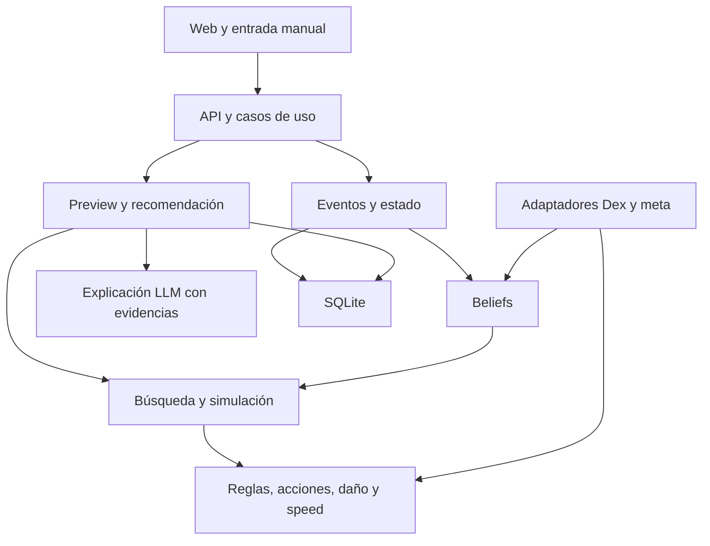

# Arquitectura

Estado: diseño baseline propuesto derivado del original §§1–4. Interfaces se concretan en cada spec antes del código.

| Área prevista | Responsabilidad y dependencias permitidas |
|---|---|
| apps/web | Next/React; contratos API; no replica reglas |
| apps/api | Casos de uso, validación Zod, composición, errores; inyecta repositorios y motores |
| packages/domain | Identidades, ruleset, estado, eventos, acciones y contratos; sin IO/framework |
| packages/champions-data | Adaptadores Dex/legalidad/SP; consume dominio |
| packages/meta-engine | Snapshots, usage y arquetipos; consume contratos de datos |
| packages/damage-engine | SmogonCalcAdapter, ChampionsRulesPatch, NCPValidator, discrepancies |
| packages/speed-engine | Cálculo contextual, prioridad/comparator, empates |
| packages/battle-engine | Reducer de observaciones y resolver de turnos; no decide acciones |
| packages/action-generator | Acciones legales y combinaciones de slots |
| packages/belief-engine | Priors, evidencia y posteriores; no muta meta global |
| packages/simulator | Ramas hipotéticas aisladas, seed, sets y pruning |
| packages/search-engine | Expectiminimax, horizonte, evaluación y riesgo |
| packages/preview-solver | Pick-4/lead/back legales y evaluados |
| packages/copilot | Recomendación, alternativas, claims, trace, degradación |
| packages/llm | Provider abstraction y herramientas restringidas |
| packages/persistence | SQLite, migraciones, repositorios y transacciones |
| packages/shared | Utilidades transversales mínimas; no almacén indiscriminado de dominio |

Los `src/adapters/champions_agent/` y `src/adapters/champions_calc/` del original se ubicarán dentro del paquete consumidor apropiado; se preserva el límite de adaptación, no una segunda jerarquía raíz duplicada. Resolver en diseño de SPEC-001/003.

## Composición y reglas

Core no importa apps, LLM, ORM o red. Persistencia implementa puertos del dominio/aplicación. Simulador importa resolver; resolver no importa search. Copilot ensambla resultados; LLM explica después y su fallo no anula el resultado matemático. Strategy Layer puede aportar valores contextuales explícitos, versionados y reproducibles; nunca reglas o modificadores inventados.

## Estado y efectos

Event log es fuente durable; BattleState es proyección operativa. Observación incompleta y turno simulado son entradas distintas. No ejecutar efectos dos veces al registrar resultados observados. Snapshots aceleran replay pero no sustituyen eventos. Un rollback debe reconstruir estado y beliefs de forma coherente e invalidar recomendaciones/cache posteriores.
